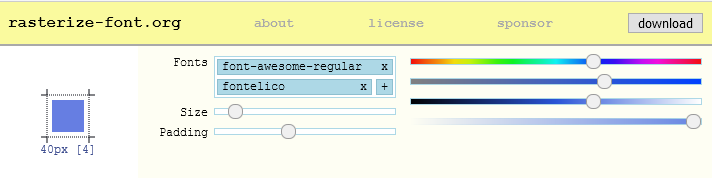
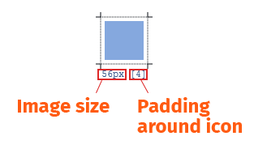
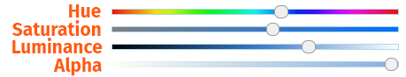

## Rasterize-font

Convert icon fonts to rasterized PNG images. Choose icons, color, padding and images are created.

### Image preview

### Settings

In addition with the `size` and `padding`, `hue`, `saturation`, `luminance`, `alpha` channel can be changed.

